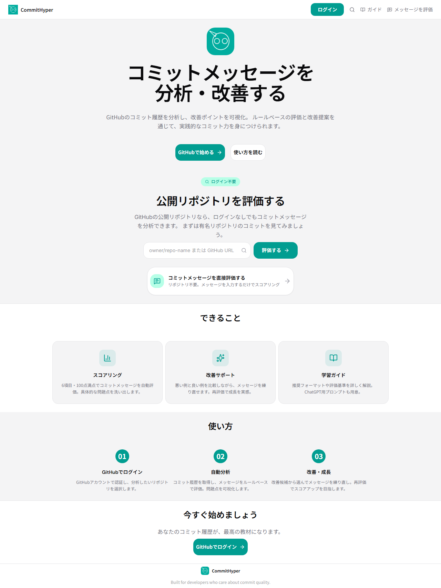
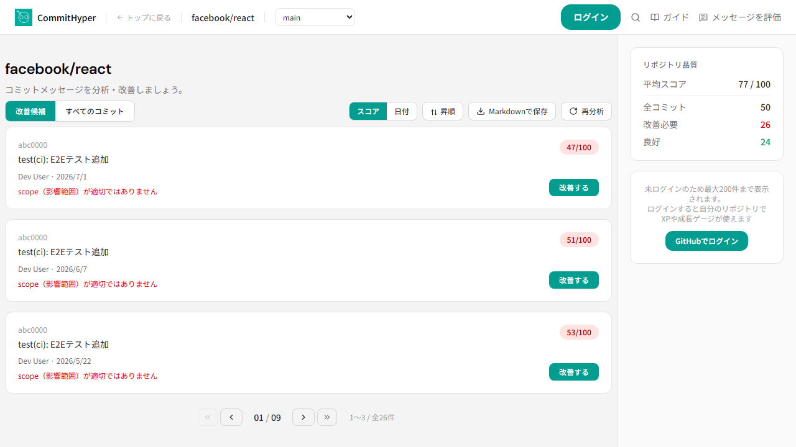
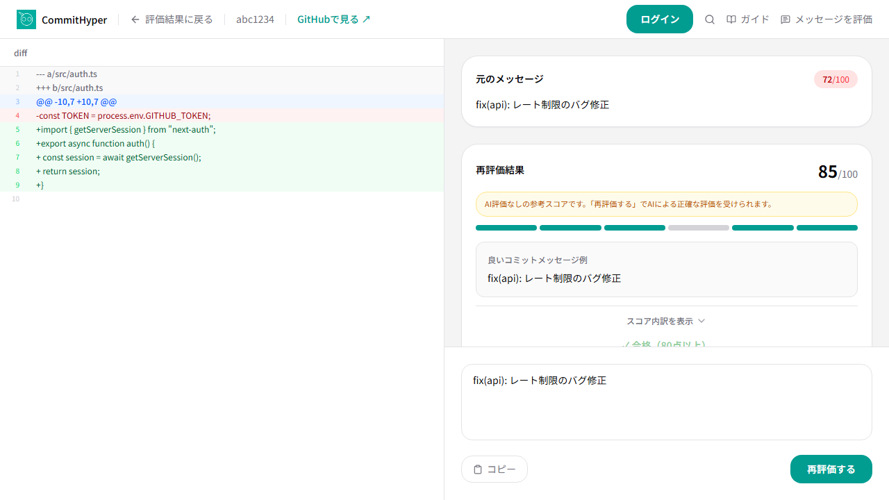
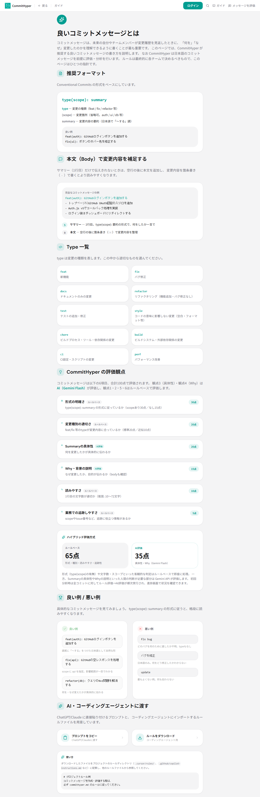

# 🚀 CommitHyper

アプリURL : [https://commithyper.vercel.app](https://commithyper.vercel.app)



GitHub リポジトリのコミットメッセージを分析・評価し、改善学習を促す Web アプリケーションです。  
過去の自分のコミットを題材に、ルールベース評価と AI 改善提案を通じて実践的なコミット力を身につけられます。

## 開発背景

チーム開発において「コミットメッセージが適当すぎて何を変更したかわからない」という経験は誰にでもあります。  
就職活動でポートフォリオとして提出するコードの品質はもちろん、**Git 履歴そのものの品質**も評価の対象になる時代です。

しかし、「良いコミットメッセージ」を実践的に学べるサービスは意外とありません。  
「Conventional Commits の仕様を読んでも、実際に自分のコミットを直して練習できる環境がない」  
という課題を解決するために CommitHyper を開発しました。

このアプリを使うことで、自身の GitHub リポジトリの全コミットを採点し、改善点を可視化。  
実際にメッセージを書き直し、合格すると XP が貰える**ゲーミフィケーション形式**で学習を継続できます。

## 主要な機能

- GitHub ログインによる自身のリポジトリ分析
- ルールベース + AI のハイブリッド評価による 100 点満点のスコアリング
- 改善候補の自動抽出と書き直し練習
- XP / レベル / 称号による成長システム
- ログイン不要の公開リポジトリ評価
- ブランチ選択による分析対象の切り替え
- 日本語コミットメッセージを前提とした評価プロンプト
- AI 評価はバッチ処理 + レート制限対策済み（Gemini 3.1 Flash Lite）

### 📊 公開評価（ログイン不要）

|                     分析開始 → SSE進捗アニメーション                     |                     結果画面の操作                          |
| :----------------------------------------------------------------------: | :--------------------------------------------------------: |
| <a href="public/images/evaluate-loading.mp4"></a> | <a href="public/images/results-interaction.mp4"></a> |

|                     改善画面（メッセージ編集→再評価）                    |
| :----------------------------------------------------------------------: |
| <a href="public/images/improve-commit.mp4"></a> |

### 📖 ガイドページ



### 🏠 ランディングページ


## 評価ロジック

コードベースの評価基準（`src/lib/evaluateCommit.ts`）:

| # | 観点 | 配点 | 主な判定基準 |
|---|------|------|-------------|
| 1 | 形式 | 30 / 15 点 | `type(scope): summary` か。scope 有無で差分 |
| 2 | 種別 | 20 / 10 点 | feat / fix / refactor 等、標準 type との一致度 |
| 3 | 具体性 | 20 点 | 固有名詞を含む明確な説明（AI 評価） |
| 4 | Why | 15 点 | body での理由説明（AI 評価） |
| 5 | 可読性 | 10 点 | 一行 10〜72 文字 |
| 6 | 追跡性 | 5 点 | Issue 番号や scope の有無 |

- 配点合計: 100 点（ルール 65 点 + AI 35 点）
- **合格ライン**: 80 点以上
- ランク: excellent (90〜100) / good (80〜89) / needs_improvement (50〜79) / poor (0〜49)
- scope なし + 課題番号なし → 79 点キャップ
- 特別処理: `Initial commit` / `Merge pull request` → 55 点で固定
- コミットメッセージは日本語を前提として評価します

### XP 付与

| スコア | 種別 | XP |
|--------|------|----|
| 90〜100 | improvement_excellent | +15 |
| 80〜89 | improvement_passed | +10 |
| 50〜79 | retry_bonus | +3 |
| 0〜49 | — | 0 |

### 成長システム

| レベル | 累計 XP | 称号 |
|--------|---------|------|
| Lv.1 | 0 | Commit Beginner |
| Lv.2 | 100 | Message Trainer |
| Lv.3 | 250 | History Cleaner |
| Lv.4 | 450 | Commit Craftsman |
| Lv.5 | 700 | Git Log Master |

## アーキテクチャ

### データ処理パイプライン

分析開始から表示まで、3 つのフェーズを SSE（Server-Sent Events）で逐次処理します:

```
Phase 1: GitHub API Fetch ──── 100 件ずつページネーション（ブランチ指定可）
         ↓
Phase 2: ルールベース評価 ──── evaluateCommit() → 平均スコア通知
         ↓ (クライアントはこの時点で暫定表示可能)
Phase 3: AI 評価 ──────────── 3件ずつバッチ処理（Gemini 3.1 Flash Lite）
         ↓
         分析完了表示
```

- AI 評価はレート制限対策済み（RPM 15 遵守のため 4 秒間隔）
- RPD 超過時はルール評価のみで表示
- 429 エラー時はリトライして継続

### 改善フロー

```
改善画面 ─→ POST /improve/[commitId] ─→ ルール + AI 評価 ─→ 結果表示（DB 未保存）
                                              ↓ (合格)
                    改善内容を保存 ─→ Commit.currentScore 更新
                                     → XpEvent 作成
                                     → User.xp 加算
                                     → Dashboard 再描画
```

### 認証

```
GitHub OAuth ─→ Auth.js v5 (JWT strategy) ─→ session.accessToken で API 呼び出し
```

各 API ルートは `auth()` でセッション検証。公開評価ルートは GITHUB_TOKEN 環境変数で代用。

### 画面構成

| ルート | 説明 |
|-------|------|
| `/` | ランディングページ |
| `/login` | GitHub ログインページ |
| `/dashboard` | リポジトリ選択 |
| `/dashboard/[owner]/[name]` | 改善候補一覧 + 成長カード・品質メトリクス |
| `/dashboard/[owner]/[name]/improve/[commitId]` | 改善画面（スプリットビュー） |
| `/guide` | 良いコミットメッセージとは（プロンプトコピー機能付き） |
| `/evaluate/[owner]/[name]` | 公開評価（ログイン不要、ブランチ選択・再分析可） |

## 使用技術

| カテゴリ | 技術 |
|---------|------|
| フレームワーク | Next.js 16.2.7 (App Router), React 19.2.4 |
| 言語 | TypeScript 5 |
| スタイリング | Tailwind CSS 4 |
| 認証 | Auth.js 5 (next-auth) — GitHub OAuth, JWT |
| ORM | Prisma 7.8.0 |
| DB | PostgreSQL (Supabase 無料枠) |
| UI コンポーネント | shadcn/ui 4.11.0 + Radix UI + lucide-react |
| アニメーション | motion (framer-motion) 12.40.0 |
| AI 評価 | Google Gemini 3.1 Flash Lite（バッチ処理・レート制限対策済み） |
| デプロイ | Vercel |
